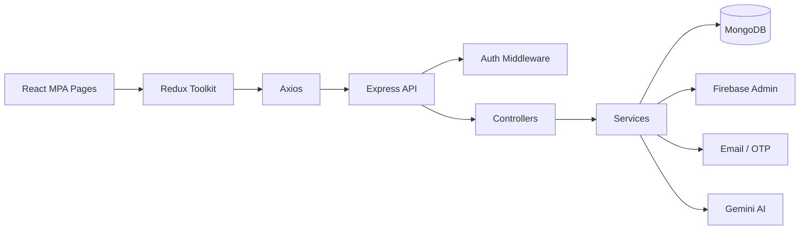

<div align="center">

# ✅ Todo — Full-Stack TypeScript Application

### A production-style Todo platform built for the **Ziptrrip Technical Assignment**

<p>
  
  
  
  
  
  
  
  
  
</p>

<p>
  
  
  
</p>

</div>

---

## 👀 Reviewer Quick Read

This repository is intentionally organized so a reviewer can understand the project quickly.

| Area | Implementation |
| --- | --- |
| Frontend | React + TypeScript + Vite |
| Architecture | **MPA (Multiple Page Application)** — separate HTML entry points |
| State management | Redux Toolkit + React Redux |
| Styling | Tailwind CSS |
| UI motion | Framer Motion |
| HTTP client | Axios |
| Backend | Node.js + Express 5 + TypeScript |
| Database | MongoDB + Mongoose |
| Authentication | JWT HttpOnly cookie + Firebase Google Sign-In |
| Password reset | Email OTP + bcrypt-hashed OTP |
| AI | Gemini-powered Todo creation |
| Testing | Vitest + Supertest |
| API verification | Postman collection + VS Code REST Client |
| CI | GitHub Actions |

### Why this project stands out

- **True MPA architecture:** separate entry pages are used instead of React Router / SPA routing.
- **End-to-end TypeScript:** frontend and backend are written in TypeScript.
- **Clean backend layering:** routes → controllers → services → models, with reusable validators and middleware.
- **Real persistence:** Todo data is stored in MongoDB.
- **Production-oriented auth:** application JWT is stored in an HttpOnly cookie; Google authentication is verified server-side with Firebase Admin.
- **Testable backend:** focused unit tests cover validators, token generation, password reset logic, and Google authentication.
- **API-ready:** the repository includes both Postman and REST Client request files.

---

## 🖼️ Architecture at a Glance



The frontend and backend remain separated, while the backend keeps transport logic, business logic, persistence, and integrations in dedicated layers.

---

## ✨ Features

### Todo management
- Create, read, update, and delete todos
- Mark todos complete / reopen
- Priority and due-date support
- Search and filtering
- Status and priority filters
- Sorting
- Pagination
- Dedicated Todo details page

### Authentication
- Email/password registration
- Email/password login
- Google Sign-In through Firebase
- Server-side Firebase ID-token verification
- JWT authentication using an HttpOnly cookie
- Logout
- Authenticated user endpoint

### Password reset
- Forgot-password flow
- Six-digit email OTP
- OTP expiry
- Hashed OTP storage
- Verified password reset

### AI-assisted workflow
- Create Todo content with Gemini AI
- Keep AI generation behind a backend API endpoint

---

## 🧭 Frontend MPA

The application deliberately uses **Multiple Page Application (MPA)** entry points.

| Page | URL | Purpose |
| --- | --- | --- |
| Todo list | `/` | View and manage todos |
| Login | `/login.html` | Local login + Google login |
| Register | `/register.html` | Local registration + Google signup |
| Create Todo | `/create.html` | Manual / AI-assisted creation |
| Todo details | `/todo.html?id=<TODO_ID>` | View and edit one Todo |
| Forgot password | `/forgot-password.html` | OTP-based password reset |

> **Assignment requirement:** the Todo details page receives the Todo ID through the query parameter.

---

## 🔐 Authentication Flow

```text
Email / Password
      │
      ▼
Express Auth API ──► MongoDB User
      │
      ▼
JWT ──► HttpOnly Cookie
      │
      ▼
Protected Todo APIs

Google Sign-In
      │
      ▼
Firebase Authentication
      │
      ▼
Firebase ID Token
      │
      ▼
POST /api/auth/google
      │
      ▼
Firebase Admin verifies token
      │
      ▼
MongoDB User ──► Application JWT Cookie
```

This keeps Google identity verification on the server while the Todo API continues to use the application's own authenticated session.

---

## 🛠️ Tech Stack — With Purpose

### Frontend

| Technology | Why it is used |
| --- | --- |
| **React 19** | Component-based UI |
| **TypeScript** | Safer typed application code |
| **Vite** | Fast development and production builds |
| **Redux Toolkit** | Centralized authentication and Todo state |
| **React Redux** | React integration for Redux state |
| **Tailwind CSS** | Utility-first styling |
| **Framer Motion** | UI transitions and interaction animation |
| **Axios** | API requests |
| **Firebase Auth** | Google authentication on the client |

### Backend

| Technology | Why it is used |
| --- | --- |
| **Node.js 22** | Server runtime |
| **Express 5** | REST API framework |
| **TypeScript** | Typed backend implementation |
| **MongoDB** | Persistent Todo and user data |
| **Mongoose** | MongoDB schema/model layer |
| **JWT** | Application authentication |
| **bcryptjs** | Password and OTP hashing |
| **Firebase Admin** | Server-side Google token verification |
| **Nodemailer** | Password-reset email delivery |
| **Helmet** | HTTP security headers |
| **CORS** | Controlled cross-origin API access |
| **express-rate-limit** | API rate-limiting support |
| **dotenv** | Environment configuration |

### Testing & Developer Tools

| Tool | Purpose |
| --- | --- |
| **Vitest** | Backend unit tests |
| **Supertest** | HTTP/API testing support |
| **Postman** | API collection for manual verification |
| **VS Code REST Client** | `.http` request definitions |
| **GitHub Actions** | Automated build and test checks |

---

## 🧱 Backend Architecture

```text
backend/
├── config/          # Database configuration
├── controllers/     # HTTP request/response handlers
├── middleware/      # Authentication and request middleware
├── models/          # Mongoose schemas
├── routes/          # REST endpoint definitions
├── services/        # Business logic
├── types/           # Shared TypeScript types
├── utils/           # JWT, email, Firebase Admin helpers
├── validators/      # Reusable validation
├── tests/           # Vitest unit tests
├── postman/         # Postman collection
├── requests/        # REST Client requests
└── dist/            # Generated build output
```

The source code is kept in TypeScript; generated build output is isolated under `dist/`.

---

## 📡 API Overview

### Authentication

| Method | Endpoint | Purpose |
| --- | --- | --- |
| POST | `/api/auth/register` | Register user |
| POST | `/api/auth/login` | Login |
| POST | `/api/auth/google` | Google authentication |
| POST | `/api/auth/logout` | Logout |
| GET | `/api/auth/me` | Current authenticated user |
| POST | `/api/auth/forgot-password` | Request reset OTP |
| POST | `/api/auth/verify-reset-code` | Verify OTP |
| POST | `/api/auth/reset-password` | Set new password |

### Todos

| Method | Endpoint | Purpose |
| --- | --- | --- |
| POST | `/api/todos` | Create Todo |
| GET | `/api/todos` | List Todos |
| GET | `/api/todos/:id` | Get one Todo |
| PATCH | `/api/todos/:id` | Update Todo |
| DELETE | `/api/todos/:id` | Delete Todo |

### AI

| Method | Endpoint | Purpose |
| --- | --- | --- |
| POST | `/api/ai/todo` | Generate Todo content with Gemini |

### Health

| Method | Endpoint | Purpose |
| --- | --- | --- |
| GET | `/api/health` | API health check |

---

## 🧪 Testing

Backend tests are executed with Vitest.

Current test coverage includes:

- Authentication validation
- JWT generation
- Password-reset service behavior
- Google authentication service behavior

Run locally:

```bash
cd backend
npm ci
npm run build
npm test
```

---

## 📬 API Testing Resources

### Postman

`backend/postman/todo-api.postman_collection.json`

### REST Client

`backend/requests/todos.http`

These resources make it easy for a reviewer to verify authentication, Todo CRUD, Google login, password reset, validation/error cases, logout, and AI Todo generation.

---

## 🚀 Local Setup

### 1. Clone the repository

```bash
git clone git@github.com:duttasirius/todo.git
cd todo
```

### 2. Backend

```bash
cd backend
cp .env.example .env
npm ci
npm run dev
```

Backend runs on:

```text
http://localhost:8000
```

### 3. Frontend

Open a second terminal:

```bash
cd frontend
cp .env.example .env
npm ci
npm run dev
```

Frontend is served by Vite.

### 4. Production builds

```bash
cd backend
npm run build

cd ../frontend
npm run build
```

---

## 🔑 Environment Variables

### Backend

```env
MONGODB_URL=
PORT=8000
JWT_SECRET=
NODE_ENV=development
GEMINI_API_KEY=
EMAIL=
EMAIL_PASS=
FIREBASE_PROJECT_ID=
FIREBASE_CLIENT_EMAIL=
FIREBASE_PRIVATE_KEY=
```

### Frontend

Use the variables documented in `frontend/.env.example`, including the Vite API URL and Firebase web configuration.

> **Security:** never commit `.env` files, MongoDB credentials, email app passwords, API keys, or Firebase service-account private keys.

---

## ✅ Assignment Compliance

The repository directly addresses the provided assignment:

| Requirement | Status |
| --- | --- |
| Git repository | ✅ |
| React MPA | ✅ |
| Todo list page | ✅ |
| Todo detail page with query parameter | ✅ |
| JS / TypeScript backend | ✅ TypeScript |
| CRUD APIs | ✅ |
| File or database persistence | ✅ MongoDB |
| Feature documentation | ✅ |
| Documentation in `.md` files | ✅ |
| Unit tests for backend submission | ✅ |
| Postman / REST Client files | ✅ |
| TypeScript extra point | ✅ |
| Database extra point | ✅ |
| Coding organization extra point | ✅ |
| Unit-test extra point | ✅ |
| API-client extra point | ✅ |

---

## 📚 Documentation

- [Root documentation](README.md)
- [Backend documentation](backend/README.md)
- [Frontend documentation](frontend/README.md)
- [Postman collection](backend/postman/todo-api.postman_collection.json)
- [REST Client requests](backend/requests/todos.http)

---

<div align="center">

### Built with React, TypeScript, Express, MongoDB, Redux Toolkit & Firebase

**Repository:** https://github.com/duttasirius/todo

</div>
